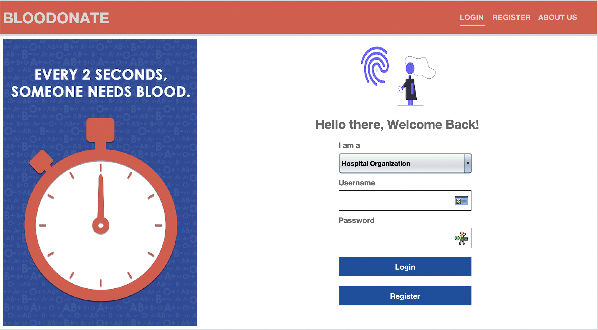
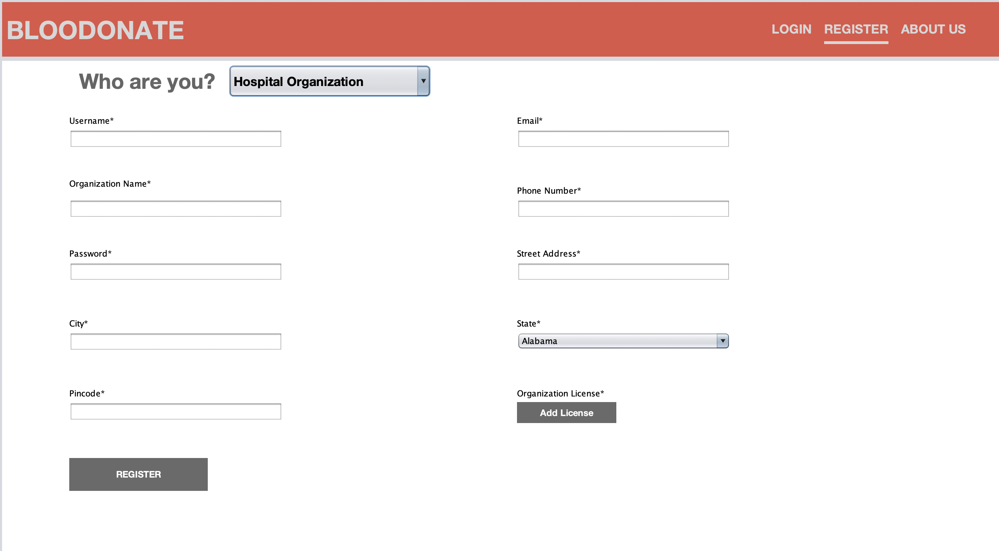
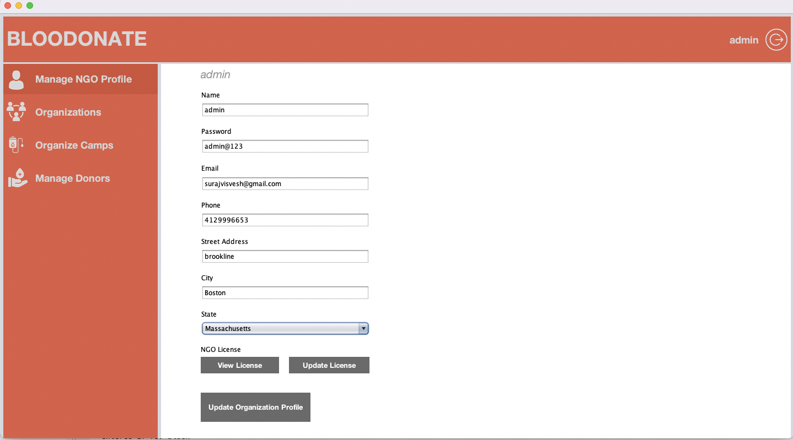
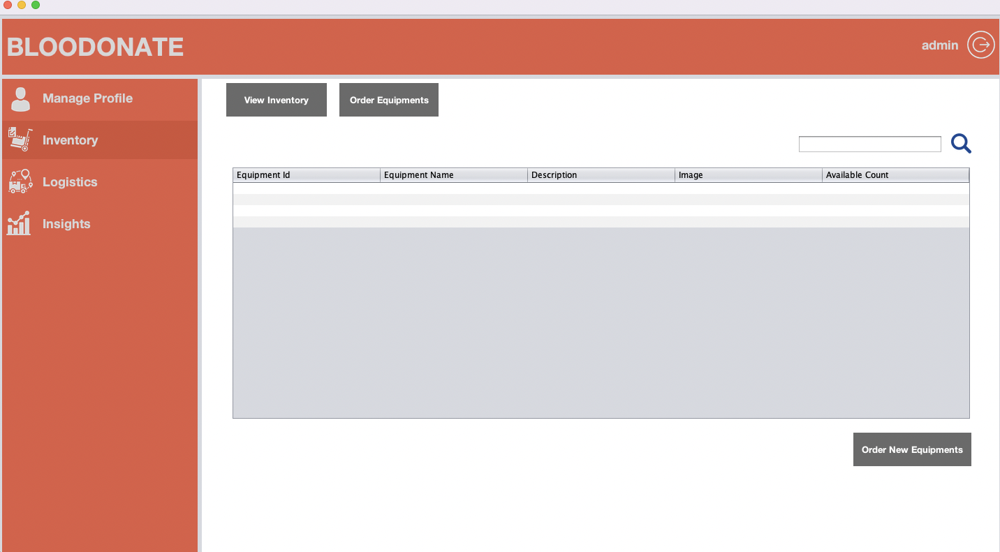
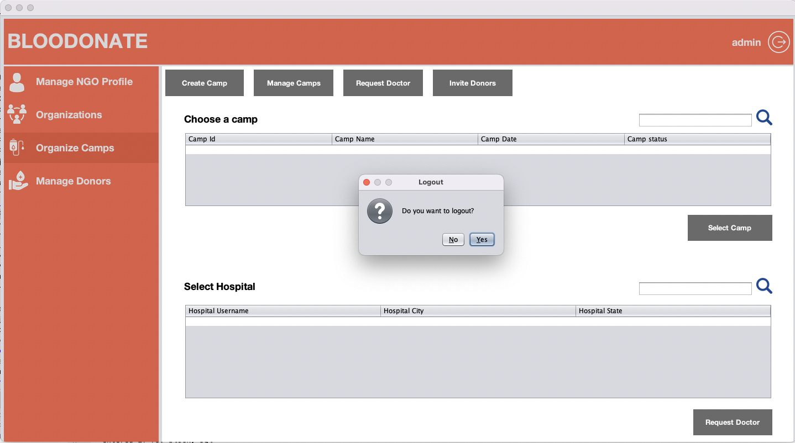
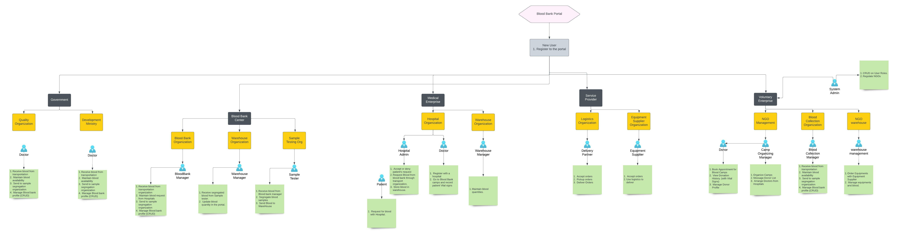

# AED_Final_Project

<h1>Blood Donors Management System</h1>

<<<<<<< HEAD
#Introduction

The Project Blood Management System is designed for the blood banks to gather blood from various sources and distribute to the needy people who have high requirement of it. The Software is desgined to handle the daily transctions of the blood band and search details when required.

# Enterprises

1. Service Provider Enterprise
2. Medical Enterprise
3. Volunteer Enterprise
4. Blood Storage Enterprise

# Orgnization

1. Hospital Organization
2. Hospital WareHouse Organization
3. Logstics Organization
4. Equipment Supplier Organization
5. Blood Bank Organization
6. Blood Bank WareHouse Organization
7. NGO Organization
8. NGO WareHouse Organization
9. NGO Blood Collection Organization

# Roles
 
1. System Admin
2. Hosptial Management Admin
3. Hosptial WareHouse Admin
4. Doctor
5. Blood Bank Management Admin
6. NGO Management Admin
7. NGO WareHouse Admin
8. NGO Blood Collection Admin
9. Logistics Admin
10. Equipment Supplier Admin
11. Blood Bank Admin
12. Blood Bank WareHouse admin

# User Requirement/Flow

* System Admin can log in to each role using system admin credentials.
* System Admin can add a new organization to the database giving access to the system.
* Every new registered user will get an email  with confirmation registration.

* Hospital Management admin can create and manage Hospital Organizations.
* Hospital Management can request Blood to Blood bank.
* Hospital WareHouse admin will be accountable to the storage and the availability of the blood in the Hospital.
* Doctor can request the blood for a patient form hospital warehouse and can have active blood donation camp details with donor list.

* NGO management admin can create and manage NGO Organizations.
* NGO can organize the blood donation camps and NGO blood collection org can collect the blood and store in NGO warehouse
* NGO warehouse admin can request to equipment supplier for required equipments during blood donation.
* Donor can directly login to NGO camps and come for blood donation.

* Servicer provider Enterprise have two organizations -Logistics Organization and Equipment Supplier Organization.
* Logistics Organization can manage and update the profile.
* Logistics org will be receiving request from Hospital, NGO, and Blood bank for transportation service.
* Logistics org can accept or deny the request and work accordingly.

* Equipment Supplier can manage and update the profile.
* Equipment Supplier can receive requests form Hospital, NGO, Blood Banks, and Logistics orgs.
* Equipment Supplier can update and manage their warehouse.

* Blood Bank management admin can create and manage Blood Banks Organizations.
* Blood Bank admin can connect with NGO orgs and collect the blood through logistics org.
* Blood Warehouse admin can request to equipment supplier for medical equipments for storing blood.

# URL for ERD diagram

# URL for Architecture Diagram

# Blood Donation Management System UI

Landing Page:

Registration Page:

Manage Profile:

Organize Camps:

Inventory:

Logout:

# Steps to Run the Project

Open the Apache NEtBeans Application

Connect MYSQL Dtabase server

Open the Blood Bank Management System Project

Run the MainFrame.java file

# Team

Divya Gadge 002792525- gadge.d@northeastern.edu
Prishaa Mittal 002765340 - mittal.pris@northeastern.edu
Suraj Viesveswaraiya 002998051 - visveswaraiya.s@northeastern.edu

=======
# URL for ERD diagram

# URL for Architecture Diagram

>>>>>>> divya_test

