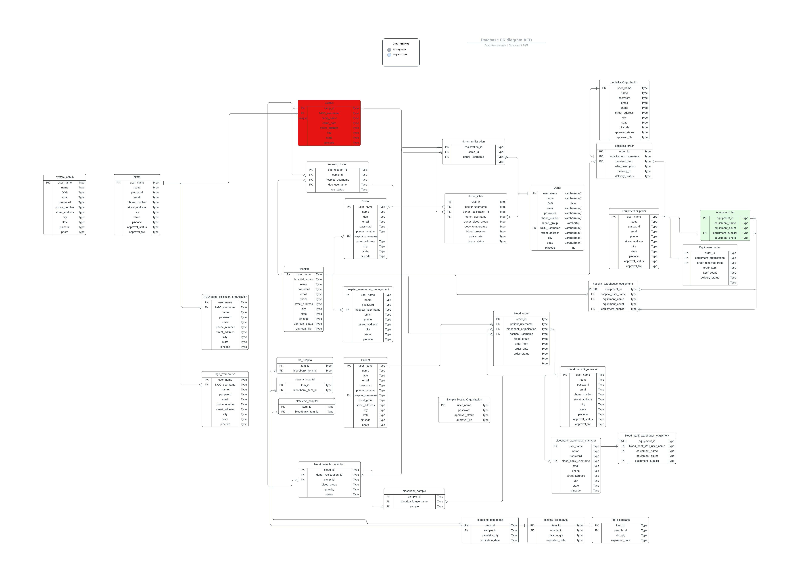

# AED_Final_Project

<h1>Blood Donors Management System</h1>

#Introduction

The Project Blood Management System is designed for the blood banks to gather blood from various sources and distribute to the needy people who have high requirement of it. The Software is desgined to handle the daily transctions of the blood band and search details when required.

# Enterprises

1. Service Provider Enterprise
2. Medical Enterprise
3. Volunteer Enterprise
4. Blood Storage Enterprise

# Orgnization

1. Hospital Organization
2. Hospital WareHouse Organization
3. Logstics Organization
4. Equipment Supplier Organization
5. Blood Bank Organization
6. Blood Bank WareHouse Organization
7. NGO Organization
8. NGO WareHouse Organization
9. NGO Blood Collection Organization

# Roles
 
1. System Admin
2. Hosptial Management Admin
3. Hosptial WareHouse Admin
4. Doctor
5. Blood Bank Management Admin
6. NGO Management Admin
7. NGO WareHouse Admin
8. NGO Blood Collection Admin
9. Logistics Admin
10. Equipment Supplier Admin
11. Blood Bank Admin
12. Blood Bank WareHouse admin

# User Requirement/Flow

# URL for ERD diagram

# URL for Architecture Diagram

# Blood Donation Management System UI

Landing Page:

Registration Page:

Manage Profile:

Organize Camps:

Inventory:

Logout:

# Steps to Run the Project

Open the Apache NEtBeans Application

Connect MYSQL Dtabase server

Open the Blood Bank Management System Project

Run the MainFrame.java file

# Team

Divya Gadge 002792525- gadge.d@northeastern.edu
Prishaa Mittal 002765340 - mittal.pris@northeastern.edu
Suraj Viesveswaraiya 002998051 - visveswaraiya.s@northeastern.edu

